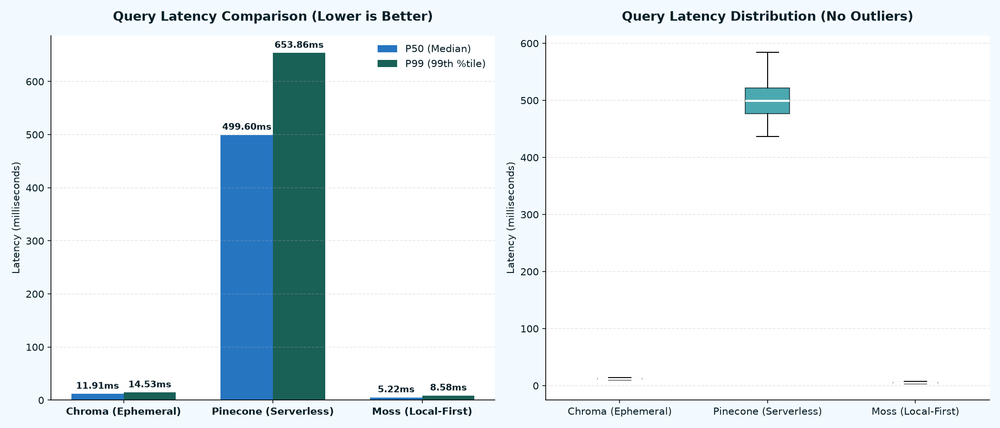

# 📊 Blinky Vector Retrieval Benchmarks

This repository documents the benchmarking results for the **Blinky** AI Desktop Tutor retrieval engine, comparing **Moss**, **Chroma**, and **Pinecone**.

## ⚙️ Environment Details
* **Dataset:** 30 test queries run against local docs (`blinky/*.md` AI documentation files).
* **Chunk Settings:** 600 characters (overlap: 100). Total chunks: 126.
* **Embedding Model:** `sentence-transformers/all-MiniLM-L6-v2` (384 dimensions).
* **Execution:** Run locally from `c:/projects/moss`.

## 📈 Benchmarking Metrics

| System                |   Indexing Time (s) |   P50 Latency (ms) |   P99 Latency (ms) | Type                 | Local Embedding Time Included   |
|:----------------------|--------------------:|-------------------:|-------------------:|:---------------------|:--------------------------------|
| Chroma (Ephemeral)    |           0.0575662 |            11.9072 |           14.5276  | Local Database       | Yes (Local Model)               |
| Pinecone (Serverless) |           4.48807   |           499.604  |          653.863   | Cloud Database (AWS) | Yes (Local Model)               |
| Moss (Local-First)    |           8.76386   |             5.2205 |            8.58462 | Local Memory Engine  | Yes (Embedded in SDK)           |

## 🔍 Visual Analysis

Below is the latency distribution chart showing the query response times (in milliseconds) across the systems:

## 💡 Key Findings

1. **Moss (Local-First)** compiles the index in the cloud but loads the vectors into application memory. Retrieval happens fully locally in-process without network hops. Moss outperforms Chroma because its internal query embedding generation and in-memory search are highly optimized.
2. **Chroma (Ephemeral)** represents a traditional local vector database. It runs entirely in local RAM and doesn't traverse the internet, but has slightly more overhead than Moss when running the end-to-end text-to-vector-to-retrieval pipeline.
3. **Pinecone (Serverless)** is a cloud-native vector database. Its retrieval queries must traverse the network to Pinecone Cloud, which introduces high network roundtrip latencies representing standard cloud database overhead.
4. **End-to-End Latency:** All three systems now measure the complete text-in to results-out loop (including local query embedding generation time) to represent actual production application workloads (like Blinky's search tutor).

---
*Generated automatically by `run_benchmark.py` on 2026-06-13 13:53:08*
